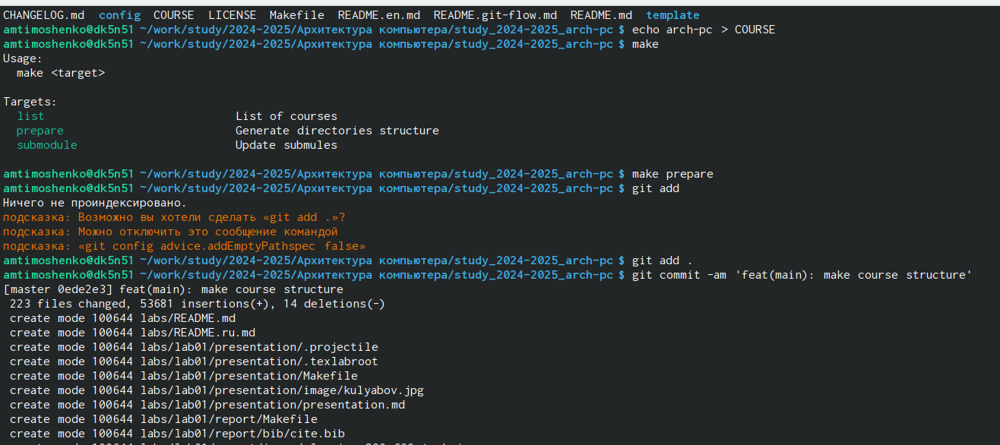

---
## Front matter
title: "Лабораторная работа №2"
subtitle: "Работа в системе Git"
author: "Тимошенко Анна Михайловна"

## Generic otions
lang: ru-RU
toc-title: "Содержание"

## Bibliography
bibliography: bib/cite.bib
csl: pandoc/csl/gost-r-7-0-5-2008-numeric.csl

## Pdf output format
toc: true # Table of contents
toc-depth: 2
lof: true # List of figures
lot: true # List of tables
fontsize: 12pt
linestretch: 1.5
papersize: a4
documentclass: scrreprt
## I18n polyglossia
polyglossia-lang:
  name: russian
  options:
	- spelling=modern
	- babelshorthands=true
polyglossia-otherlangs:
  name: english
## I18n babel
babel-lang: russian
babel-otherlangs: english
## Fonts
mainfont: IBM Plex Serif
romanfont: IBM Plex Serif
sansfont: IBM Plex Sans
monofont: IBM Plex Mono
mathfont: STIX Two Math
mainfontoptions: Ligatures=Common,Ligatures=TeX,Scale=0.94
romanfontoptions: Ligatures=Common,Ligatures=TeX,Scale=0.94
sansfontoptions: Ligatures=Common,Ligatures=TeX,Scale=MatchLowercase,Scale=0.94
monofontoptions: Scale=MatchLowercase,Scale=0.94,FakeStretch=0.9
mathfontoptions:
## Biblatex
biblatex: true
biblio-style: "gost-numeric"
biblatexoptions:
  - parentracker=true
  - backend=biber
  - hyperref=auto
  - language=auto
  - autolang=other*
  - citestyle=gost-numeric
## Pandoc-crossref LaTeX customization
figureTitle: "Рис."
tableTitle: "Таблица"
listingTitle: "Листинг"
lofTitle: "Список иллюстраций"
lotTitle: "Список таблиц"
lolTitle: "Листинги"
## Misc options
indent: true
header-includes:
  - \usepackage{indentfirst}
  - \usepackage{float} # keep figures where there are in the text
  - \floatplacement{figure}{H} # keep figures where there are in the text
---
1. Цель работы
2. Задания
3. Теоретическое введение
4. Выполнение лабораторной работы
5. Вывод

# Цель работы

Изучить принципы и использование средств контроля версий, а
также получить практические навыки в системе Git.

# Задание

1. Ознакомиться с документацией, приложенной к лабораторной
работе номер 2
2. Настроить Github
3. Создать SSH ключ, а также рабочее пространство
4. Создать репозиторий и настроить каталог курса
5. Выполнить задания для самостоятельной работы

# Теоретическое введение

Системы контроля версий (Version Control System, VCS)
используются для совместной работы нескольких человек над одним
проектом. В основном, основное дерево проекта хранится в
локальном или удалённом репозитории, к которому участники
проекта имеют доступ. При внесении изменений в проект, система
контроля версий позволяет фиксировать эти изменения, объединять
правки, сделанные разными участниками, а также откатываться к
любой предыдущей версии проекта по мере необходимости.

# Выполнение лабораторной работы

Перед началом выполнения лабораторной работы был создан
аккаунт на Github и заполнены основные данные пользователя. Далее
открываем терминал и создаем предварительную конфигурацию git.
Настраиваем utf-8 в выводе сообщений. Задаём имя начальной ветки
(master). Параметр autocrlf, параметр safecrlf.   
{width=100%}
Рис.1 Базовая настройка Git

Далее требуется создать SSH ключ для для последующей индентефикации
пользователя на сервере репозитория. Сгенерированный открытый ключ
необходимо загрузить на сайте Github под своей учетной записью.   
{width=100%}
Рис.2 Создание SSH ключа

В следующем пункте необходимо создать рабочее пространство по
следующей иерархии: ~/work/study/
└── <учебный год>/
└── / <название предмета>
└── / <код предмета>
Для создания каталогов используем команду mkdir -p
Каталог для лабораторных работ имеет вид labs.
Каталоги для лабораторных работ имеют вид lab<номер>, например: lab01,
lab02 и т.д.   
{width=100%}
Рис. 3 Создание рабочего пространства и репозитория курса на основе шаблона

Репозиторий на основе шаблона делаем на сервере Github. В открывшемся
окне задаём имя репозиторию study_2024-2025_arch-pc и создаем его.
Клонируем созданный репозиторий с помощью команды git clone --recursive
(показано в рис.4). Ссылку для клонирования копируем на сайте созданного
репозитория   
{width=100%}
Рис.4 Создание репозитория на основе шаблона

Далее надо настроить каталог курса, но сперва удаляем ненужные файлы.
Переходим в каталог курса и с помощью команды rm package.json удаляем
лишние файлы.   
{width=100%}
Рис.5 Удаление ненужных файлов

В этом же пункте требуется создать необходимые каталоги с помощью
echo arch-pc > COURSE make.
Далее отправляем файлы на сервер:
git add .
git commit -am 'feat(main): make course structure'
git push   
{width=100%}
Рис. 6 Создание необходимых катологов

{width=100%}
Рис. 7 Созданеи необходимых катологов

После создания каталогов требуется проверить правильности создания
иерархии рабочего пространства в локальном репозитории и на странице github.   
{width=100%}
Рис. 8 Проверка на странице Github

{width=100%}
Рис.9 Проверка в локальном репозитории

В следующем пункте требуется выполнить ряд самостоятельных заданий:
1) Создать отчет по выполнению лабораторной работы в соответствующим
каталоге
рабочего пространства
2) Скопировать отчеты по выполнению предыдущих лабораторных работ в
соответствующие каталоги созданного рабочего пространства
3) Загрузить файлы на сервер Github

# Выводы

В завершение своей работы с Github я освоила основные команды для
эффективной работы, а также подготовила рабочее пространство.

# Список литературы{.unnumbered}

::: {#refs}
:::
