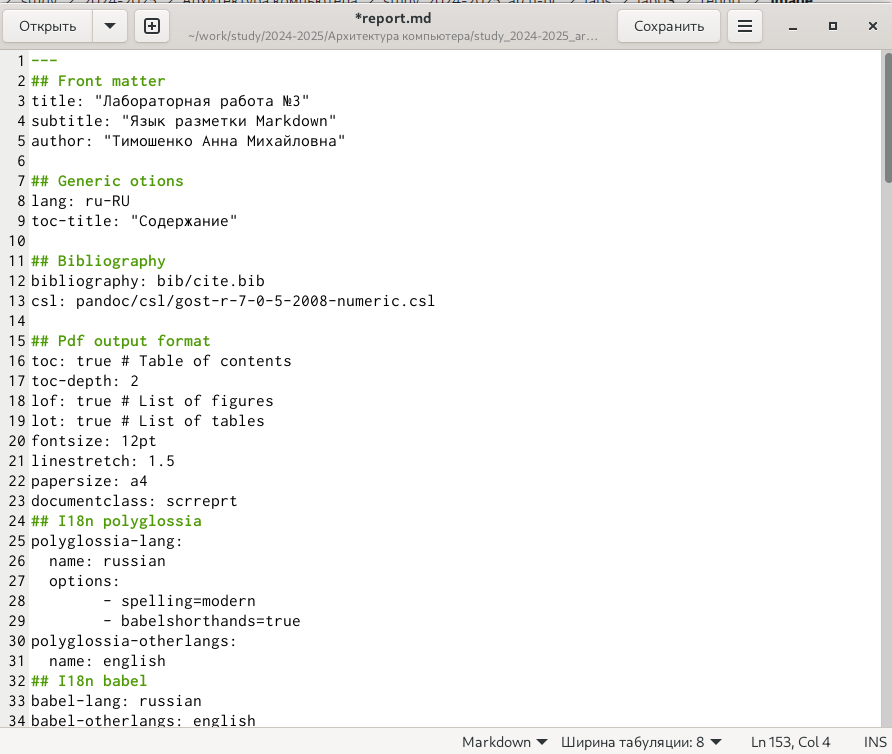

---
## Front matter
title: "Лабораторная работа №3"
subtitle: "Язык разметки Markdown"
author: "Тимошенко Анна Михайловна"

## Generic otions
lang: ru-RU
toc-title: "Содержание"

## Bibliography
bibliography: bib/cite.bib
csl: pandoc/csl/gost-r-7-0-5-2008-numeric.csl

## Pdf output format
toc: true # Table of contents
toc-depth: 2
lof: true # List of figures
lot: true # List of tables
fontsize: 12pt
linestretch: 1.5
papersize: a4
documentclass: scrreprt
## I18n polyglossia
polyglossia-lang:
  name: russian
  options:
	- spelling=modern
	- babelshorthands=true
polyglossia-otherlangs:
  name: english
## I18n babel
babel-lang: russian
babel-otherlangs: english
## Fonts
mainfont: IBM Plex Serif
romanfont: IBM Plex Serif
sansfont: IBM Plex Sans
monofont: IBM Plex Mono
mathfont: STIX Two Math
mainfontoptions: Ligatures=Common,Ligatures=TeX,Scale=0.94
romanfontoptions: Ligatures=Common,Ligatures=TeX,Scale=0.94
sansfontoptions: Ligatures=Common,Ligatures=TeX,Scale=MatchLowercase,Scale=0.94
monofontoptions: Scale=MatchLowercase,Scale=0.94,FakeStretch=0.9
mathfontoptions:
## Biblatex
biblatex: true
biblio-style: "gost-numeric"
biblatexoptions:
  - parentracker=true
  - backend=biber
  - hyperref=auto
  - language=auto
  - autolang=other*
  - citestyle=gost-numeric
## Pandoc-crossref LaTeX customization
figureTitle: "Рис."
tableTitle: "Таблица"
listingTitle: "Листинг"
lofTitle: "Список иллюстраций"
lotTitle: "Список таблиц"
lolTitle: "Листинги"
## Misc options
indent: true
header-includes:
  - \usepackage{indentfirst}
  - \usepackage{float} # keep figures where there are in the text
  - \floatplacement{figure}{H} # keep figures where there are in the text
---

1. Цель работы
2. Задание
3. Теоретическое введение
4. Выполнение лабораторной работы
5. Выводы 
6. Список литературы

# Цель работы

Изучить работу языка разметки Markdown, выполнить задачи согласно лабораторной работе и подготовить отчет о проделанной работе.

# Задание

1. Изучить основные сведения о Markdown.
2. Перейти в каталог "arch-pc" и выполнить команду git pull.
3. Запустить команду make для компиляции шаблона.
4. Удалить созданные файлы с помощью Makefile.
5. Открыть файл report.md в любом текстовом редакторе.
6. Заполнить отчет и скомпилировать его, используя Makefile.
7. Загрузить файлы на GitHub.
8. Выполнить задание для самостоятельной работы.

# Теоретическое введение

Чтобы создать заголовок, используйте знак #, например:
# This is heading 1
## This is heading 2

Чтобы задать для текста полужирное начертание, заключите его в двойные звездочки:
This text is **bold**.

Чтобы задать для текста курсивное начертание, заключите его в одинарные звездочки:
This text is *italic*.

Чтобы задать для текста полужирное и курсивное начертание, заключите его в тройные
звездочки:
This is text is both ***bold and italic***.

Блоки цитирования создаются с помощью символа >:
> The drought had lasted now for ten million years, and the reign of the

Упорядоченный список можно отформатировать с помощью соответствующих цифр:
Архитектура ЭВМ
1. First instruction
  1. Sub-instruction
  1. Sub-instruction
1. Second instruction

Чтобы вложить один список в другой, добавьте отступ для элементов дочернего списка:
1. First instruction
1. Second instruction

Неупорядоченный (маркированный) список можно отформатировать с помощью звездо-
чек или тире:
* List item

Чтобы вложить один список в другой, добавьте отступ для элементов дочернего списка:
- List item 1
- List item A

Синтаксис Markdown для встроенной ссылки состоит из части [link text], представляю-
щей текст гиперссылки, и части (file-name.md) – URL-адреса или имени файла, на который
дается ссылка:
[link text](file-name.md)
или
[link text](http://example.com/ "Необязательная подсказка")

Markdown поддерживает как встраивание фрагментов кода в предложение, так и их разме-
щение между предложениями в виде отдельных огражденных блоков. Огражденные блоки
кода — это простой способ выделить синтаксис для фрагментов кода. Общий формат ограж-
денных блоков кода:
``` language
your code goes in here
```


# Выполнение лабораторной работы

1. Изучила основные сведения о Markdown.

2. Переходим в каталог ресурса, созданной в лаьораторной работе №2. С помощью команды git pull скачиваем изменения из удаленного репозитория. Переходим в каталог с шаблоном отчета по лабораторной работе № 3   
{width=100%}
Рис.1 Генерация дополнительных файлов report.pdf и report.docx

3. С помощью Makefile проводим компиляцию шаблона(команда make) - (смотреть рис. 1) Теперь сгенирировались report.pdf и report.docx.Проверяем их наличие.

4.  C помощью make clean удаляем полученные файлы.Проверяем их отсутсвие    
{width=100%}
Рис. 2 Удаление дополнительных файлов report.pdf и report.docx


5. Открыть файл report.md в любом текстовом формате   
{width=100%}
Рис.3 Работа с report.md в текстовом редакторе


6. 
Заполняю отчет о выполнении лабораторной работы - (смотреть рис. 3)

7. 
Загружаю файлы на Github

8. 
Выполняю самостоятельную работу

# Выводы

Изучение языка разметки Markdown позволило глубже понять его возможности и применение для форматирования текста. Выполнение задач согласно лабораторной работе способствовало закреплению знаний и практическим навыкам работы с Markdown.

# Список литературы{.unnumbered}

::: {#refs}
:::
