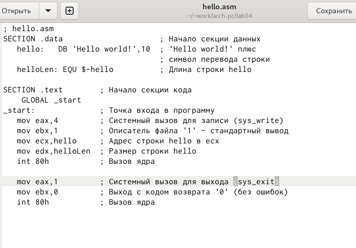
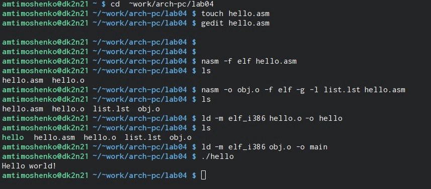
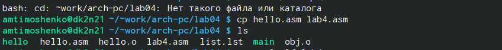
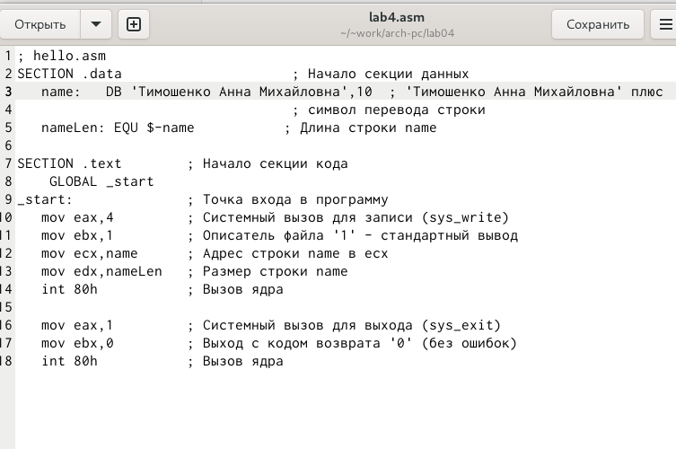
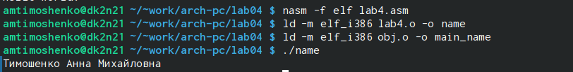

---
## Front matter
title: "Лабораторная работа №4"
subtitle: "Создание и процесс обработки программ на языке ассемблера NASM"
author: "Тимошенко Анна Михайловна"

## Generic otions
lang: ru-RU
toc-title: "Содержание"

## Bibliography
bibliography: bib/cite.bib
csl: pandoc/csl/gost-r-7-0-5-2008-numeric.csl

## Pdf output formatА
toc: true # Table of contents
toc-depth: 2
lof: true # List of figures
lot: true # List of tables
fontsize: 12pt
linestretch: 1.5
papersize: a4
documentclass: scrreprtА
## I18n polyglossia
polyglossia-lang:
  name: russian
  options:
	- spelling=modern
	- babelshorthands=true
polyglossia-otherlangs:
  name: english
## I18n babelА
babel-lang: russian
babel-otherlangs: english
## Fonts
mainfont: IBM Plex Serif
romanfont: IBM Plex Serif
sansfont: IBM Plex Sans
monofont: IBM Plex Mono
mathfont: STIX Two Math
mainfontoptions: Ligatures=Common,Ligatures=TeX,Scale=0.94
romanfontoptions: Ligatures=Common,Ligatures=TeX,Scale=0.94
sansfontoptions: Ligatures=Common,Ligatures=TeX,Scale=MatchLowercase,Scale=0.94
monofontoptions: Scale=MatchLowercase,Scale=0.94,FakeStretch=0.9
mathfontoptions:
## Biblatex
biblatex: true
biblio-style: "gost-numeric"
biblatexoptions:
  - parentracker=true
  - backend=biber
  - hyperref=auto
  - language=auto
  - autolang=other*
  - citestyle=gost-numeric
## Pandoc-crossref LaTeX customization
figureTitle: "Рис."
tableTitle: "Таблица"
listingTitle: "Листинг"
lofTitle: "Список иллюстраций"
lotTitle: "Список таблиц"
lolTitle: "Листинги"
## Misc options
indent: true
header-includes:
  - \usepackage{indentfirst}
  - \usepackage{float} # keep figures where there are in the text
  - \floatplacement{figure}{H} # keep figures where there are in the text
---
Цель работы                             
Задание                                           
Теоретическое введение                         
Выполнение лабораторной работы                
Выводы                               

# Цель работы

Освоение процедуры компиляции и сборки программ, написанных на ассемблере NASM

# Задание

1. Программа HELLO WORLD!
  1.1 создать каталог для работы с программами на языке NASM
  1.2 перейти в созданный каталог
  1.3 создать текстовый файл с именем hello.asm 
  1.4 открыть файл
  1.5 ввести в него указанный текст
  
2. Транслятор NASM 
  2.1 выполнить компиляцию в объектный код
  
3. Расширенный синтаксис
  3.1 выполнить компиляцию файла
  
4. Компановщик LD
  4.1 передать объектный файл на обработку компановщику
  
5. Запустить исполняемый файл

6. Задание для самостоятельной работы
  6.1 создать копию файла hello.asm с именем lab4.asm
  6.2 изменить скопированный файл, чтобы выводилась строка с именем и фамилией
  6.3 оттранслировать полученный текст программы lab4.asm в объектный файл
  6.4 скопировать файлы hello.asm и lab4.asm в локальный репозиторий
  
# Теоретическое введение

  Язык ассемблера (assembly language, сокращённо asm) — машинно-ориентированный
язык низкого уровня. Можно считать, что он больше любых других языков приближен к
архитектуре ЭВМ и её аппаратным возможностям, что позволяет получить к ним более
полный доступ, нежели в языках высокого уровня, таких как C/C++, Perl, Python и пр. Заметим,
что получить полный доступ к ресурсам компьютера в современных архитектурах нельзя,
самым низким уровнем работы прикладной программы является обращение напрямую к
ядру операционной системы. Именно на этом уровне и работают программы, написанные
на ассемблере. Но в отличие от языков высокого уровня ассемблерная программа содержит
только тот код, который ввёл программист.Таким образом язык ассемблера — это язык, с
помощью которого понятным для человека образом пишутся команды для процессора.
   Следует отметить, что процессор понимает не команды ассемблера, а последовательности
из нулей и единиц — машинные коды. До появления языков ассемблера программистам
приходилось писать программы, используя только лишь машинные коды, которые были
крайне сложны для запоминания, так как представляли собой числа, записанные в двоичной
или шестнадцатеричной системе счисления. Преобразование или трансляция команд с
языка ассемблера в исполняемый машинный код осуществляется специальной программой
транслятором — Ассемблер
# Выполнение лабораторной работы

1. Программа HELLO WORLD! (см. рис.1)  
  1.1 создать каталог для работы с программами на языке NASM (см. рис.1)  
  1.2 перейти в созданный каталог (см. рис.1)  
  1.3 создать текстовый файл с именем hello.asm  (см. рис.1)  
  1.4 открыть файл (см. рис.1)  
  1.5 ввести в него указанный текст (см. рис.2)  
  
{width=100%}   
РИС.2 Ввод текста в файл hello.asm  
  
2. Транслятор NASM (см. рис.1)   
  2.1 выполнить компиляцию в объектный код (см. рис.1)  
  
3. Расширенный синтаксис (см. рис.1)  
  3.1 выполнить компиляцию файла (см. рис.1)  
  
4. Компановщик LD (см. рис.1)  
  4.1 передать объектный файл на обработку компановщику (см. рис.1)  
  
5. Запустить исполняемый файл (см. рис.1)  

{width=100%}   
РИС.1 Выполнение лабораторной работы  

6. Задание для самостоятельной работы   
  6.1 создать копию файла hello.asm с именем lab4.asm (см. рис.3)  
  
{width=100%}   
РИС.3 Создание копии файла hello.asm с именем lab4.asm  
  
  6.2 изменить скопированный файл, чтобы выводилась строка с именем и фамилией (см. рис.4)  
  
{width=100%}   
РИС.4 Изменение файла lab4.asm  

  6.3 оттранслировать полученный текст программы lab4.asm в объектный файл (см. рис.5)  
  6.4 скопировать файлы hello.asm и lab4.asm в локальный репозиторий (см. рис.5)  
  
{width=100%}   
РИС.5 скопировать файлы в локальный репозиторий  

# Выводы

Я ознакомилась с созданием и процессом обработки программ на языке ассемблера NASM

