---
## Front matter
title: "Отчёт по лабораторной работе 5"
subtitle: "Структура программ на языке ассемблера NASM. Системные вызовы в ОС GNU Linux"
author: "Тимошенко Анна Михайловна"

## Generic otions
lang: ru-RU
toc-title: "Содержание"

## Bibliography
bibliography: bib/cite.bib
csl: pandoc/csl/gost-r-7-0-5-2008-numeric.csl

## Pdf output format
toc: true # Table of contents
toc-depth: 2
lof: true # List of figures
lot: true # List of tables
fontsize: 12pt
linestretch: 1.5
papersize: a4
documentclass: scrreprt
## I18n polyglossia
polyglossia-lang:
  name: russian
  options:
	- spelling=modern
	- babelshorthands=true
polyglossia-otherlangs:
  name: english
## I18n babel
babel-lang: russian
babel-otherlangs: english
## Fonts
mainfont: IBM Plex Serif
romanfont: IBM Plex Serif
sansfont: IBM Plex Sans
monofont: IBM Plex Mono
mathfont: STIX Two Math
mainfontoptions: Ligatures=Common,Ligatures=TeX,Scale=0.94
romanfontoptions: Ligatures=Common,Ligatures=TeX,Scale=0.94
sansfontoptions: Ligatures=Common,Ligatures=TeX,Scale=MatchLowercase,Scale=0.94
monofontoptions: Scale=MatchLowercase,Scale=0.94,FakeStretch=0.9
mathfontoptions:
## Biblatex
biblatex: true
biblio-style: "gost-numeric"
biblatexoptions:
  - parentracker=true
  - backend=biber
  - hyperref=auto
  - language=auto
  - autolang=other*
  - citestyle=gost-numeric
## Pandoc-crossref LaTeX customization
figureTitle: "Рис."
tableTitle: "Таблица"
listingTitle: "Листинг"
lofTitle: "Список иллюстраций"
lotTitle: "Список таблиц"
lolTitle: "Листинги"
## Misc options
indent: true
header-includes:
  - \usepackage{indentfirst}
  - \usepackage{float} # keep figures where there are in the text
  - \floatplacement{figure}{H} # keep figures where there are in the text
---
1.  Цель работы
2.  Задание
3.  Теоретическое введение
4.  Выполнение лабораторной работы
5.  Вывод

# Цель работы

Изучить структуру программы на языке ассемблера NASM

# Задание

1. Открыть Midnight Commander
2. Создать папку lab05 и внутри нее создать файл lab5-1.asm
3. Открыть файл lab5-1.asm, ввести информацию из листинга 5.1 и сохранить изменения
4. Убедится, что файл содержит информацию
5. Оттранслировать текст файла lab5-1.asm, выполнить компановку объектного файла
6. Запустить файл
7. Скачать и скопировать файл in_out.asm с помощью клавиши f5
8. С помощью клавиши f6 скопировать файл lab5-1.asm с именем lab5-2.asm
9. Исправить файл lab5-2.asm в соответствии с листингом 5.2
10. В файле lab5-2.asm заменить подпрограмму sprintLF на sprint
11. Создать исполняемый файл и проверить его работу
12. Создать копию файла lab5-1.asm и внести изменения, чтобы выводила введенная строка на экран
13. Создать копию файла lab5-2.asm и внести изменения, чтобы выводила введенная строка на экран

# Теоретическое введение

   Программа на языке ассемблера NASM, как правило, состоит из трёх секций: секция кода
программы (SECTION .text), секция инициированных (известных во время компиляции)
данных (SECTION .data) и секция неинициализированных данных (тех, под которые во
время компиляции только отводится память, а значение присваивается в ходе выполнения
программы) (SECTION .bss).
  Таким образом, общая структура программы имеет следующий вид:
SECTION .data ; Секция содержит переменные, для
...           ; которых задано начальное значение

  Инструкция языка ассемблера mov предназначена для дублирования данных источника в
приёмнике. В общем виде эта инструкция записывается в виде
mov dst,src
  Здесь операнд dst — приёмник, а src — источник.
  В качестве операнда могут выступать регистры (register), ячейки памяти (memory) и непо-
средственные значения (const). В табл. 5.4 приведены варианты использования mov с разны-
ми операндами.

Таблица 5.4. Варианты использования mov с разными операндами
Тип операндов     Пример         Пояснение
mov <reg>,<reg>   mov eax,ebx    пересылает значение
                                 регистра ebx в регистр
                                 eax
mov <reg>,<mem>   mov cx,[eax]   пересылает в регистр cx
                                 значение из памяти,
                                 указанной в eax
mov <mem>,<reg>   mov rez,ebx    пересылает в
                                 переменную rez
                                 значение из регистра
                                 ebx
mov <reg>,<const> mov eax,403045h пишет в регистр eax
                                  значение 403045h
mov <mem>,<const> mov byte[rez],0 записывает в
                                  переменную rez
                                  значение 0

# Выполнение лабораторной работы

1. Открыть Midnight Commander (см рис 1)   

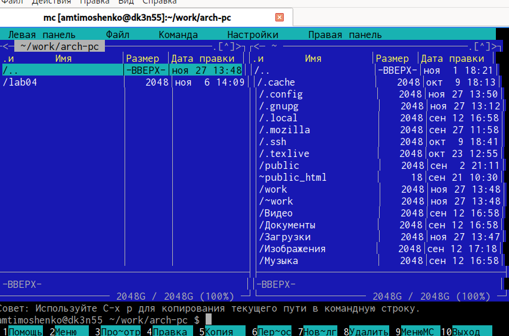{width=100%}   
Рис.1 Открытый МС   

2. Создать папку lab05 и внутри нее создать файл lab5-1.asm (см рис 2)   

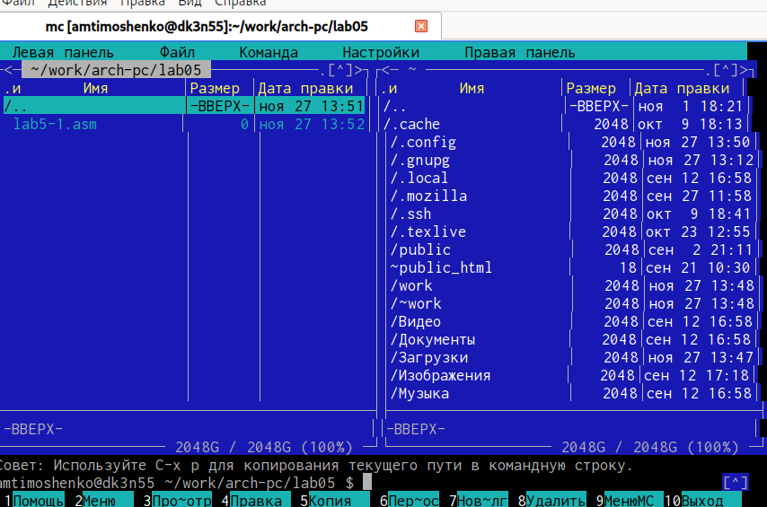{width=100%}   
Рис. 2 Создание папки lab05 и файла lab5-1.asm   

3. Открыть файл lab5-1.asm, ввести информацию из листинга 5.1 и сохранить изменения (см рис 3)  
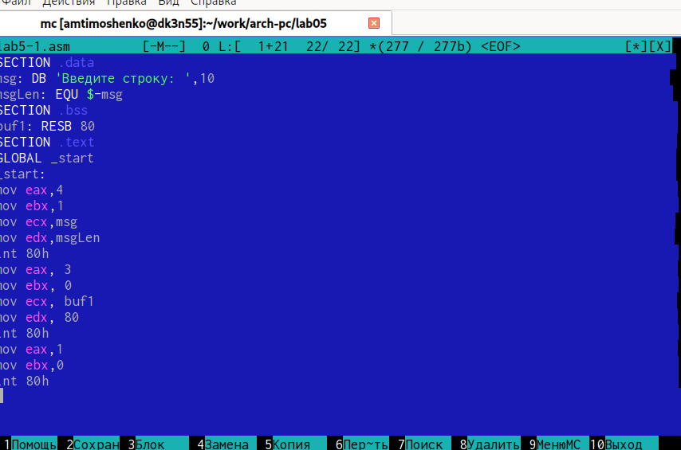{width=100%}   
Рис. 3 Открытый файл lab5-1.asm   

4. Убедится, что файл содержит информацию (см рис 3)  
5. Оттранслировать текст файла lab5-1.asm, выполнить компановку объектного файла (см рис 4)  
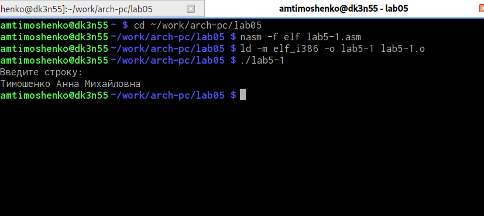{width=100%}  
Рис.4 Выполнение команд  
6. Запустить файл (см рис 4)  
7. Скачать и скопировать файл in_out.asm с помощью клавиши f5 (см рис 5)  
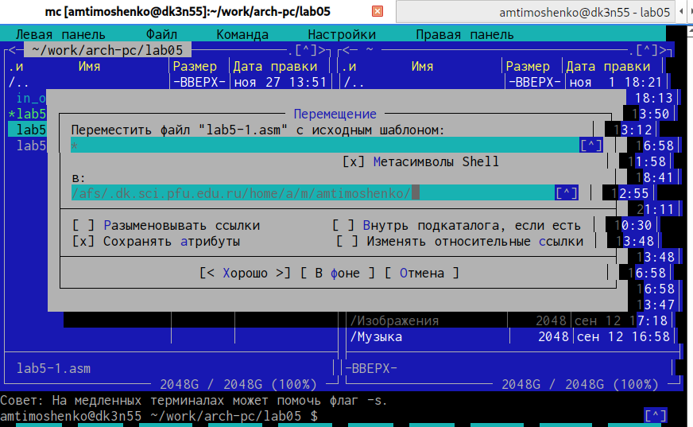{width=100%}  
Рис.5 Скопированный in_out.asm через f5 
8. С помощью клавиши f6 скопировать файл lab5-1.asm с именем lab5-2.asm (см рис 6)  
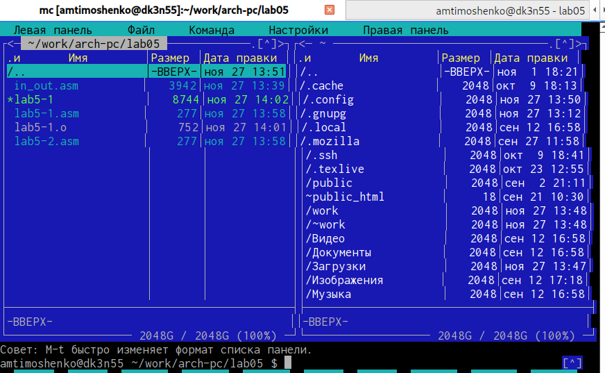{width=100%}  
Рис.6 Cкопированный файл lab5-1.asm с именем lab5-2.asm   
9. Исправить файл lab5-2.asm в соответствии с листингом 5.2 и заменить подпрограмму sprintLF на sprint (см рис 7)  
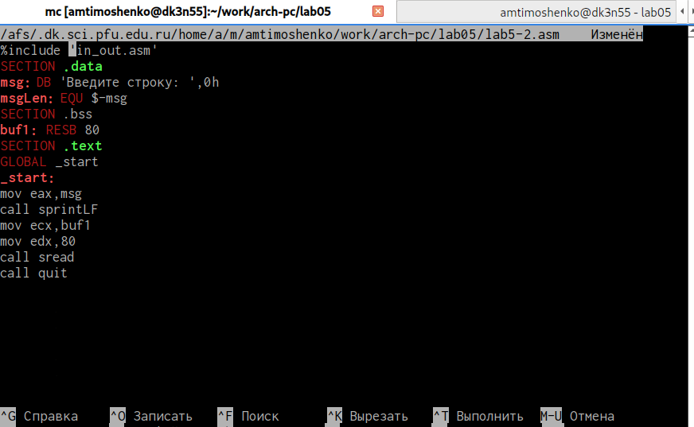{width=100%}  
Рис.7 Исправленный файл lab5-2.asm   
10. Создать исполняемый файл и проверить его работу (см рис 8)   
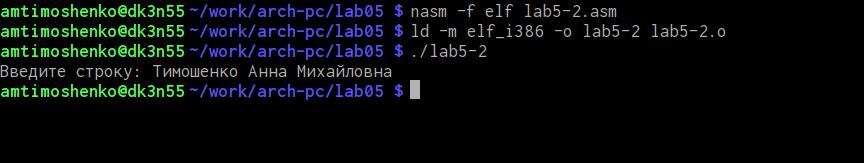{width=100%}  
Рис.8 Проверка и создание файла   
Заметна разница: теперь после вывода сообщения нет перехода на новую строку.  
11. Создать копию файла lab5-1.asm и внести изменения, чтобы выводила введенная строка на экран (см рис 9-10)   
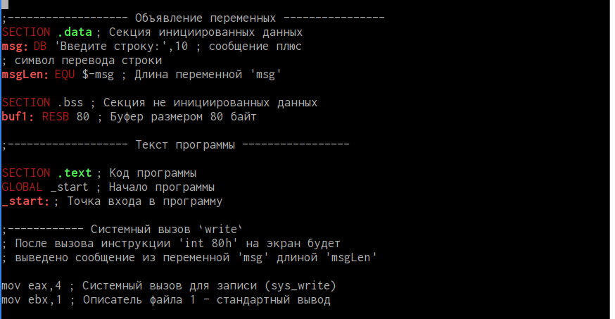{width=100%}  
Рис.9 Вносим изменения  
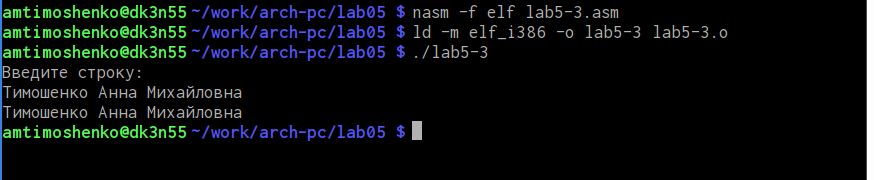{width=100%}  
Рис.10 Вывод введенной строки на экран  
12. Создать копию файла lab5-2.asm и внести изменения, чтобы выводила введенная строка на экран (см рис 11-12)   
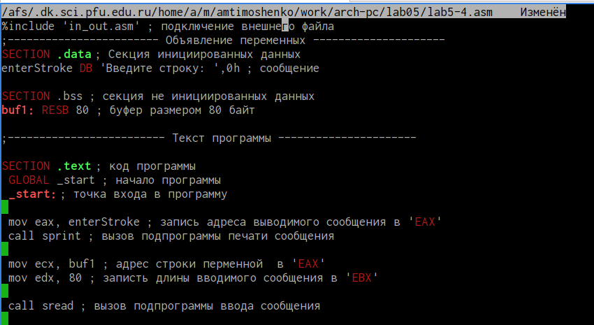{width=100%}  
Рис.11 Вносим изменения  
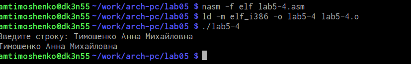{width=100%}  
Рис.12  Вывод введенной строки на экран

# Выводы

В процессе выполнения лабораторной работы я ознакомилась со структурой программы на языке ассемблера NASM 

# Список литературы{.unnumbered}

::: {#refs}
:::
